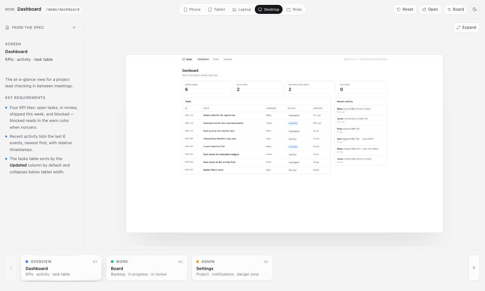

# Viewfinder

A review canvas for deployed prototypes. Paste a Vercel (or any deployed)
URL, list your screens, and Viewfinder frames them across five breakpoints —
phone, tablet, laptop, desktop, and wide — with a filmstrip to walk the
screens and your product spec pinned beside each one.

Built for design reviews: instead of resizing a browser window on a call,
you click through real screens at real viewport sizes, with the requirements
that screen is supposed to satisfy sitting right next to it.



**Live demo:** [viewfinder-eta.vercel.app/?demo=1](https://viewfinder-eta.vercel.app/?demo=1)

## What it does

- **Five breakpoints, real rendering.** The iframe renders at the native
  viewport size (e.g. 1920×1080) and is scaled to fit, so the prototype's
  own responsive breakpoints fire exactly as they would on the device.
- **Filmstrip walkthrough.** Screens line up as cards along the bottom.
  Arrow keys step through them; each selection remounts the iframe so
  flows start fresh.
- **Spec beside the work.** Paste or upload a markdown file (a Notion
  export works) and each `##` section appears in the left rail next to
  its screen.
- **Source handoff.** Attach source-file URLs to a screen and a Source
  menu appears — engineers can open or download the files behind what
  they're looking at.
- **Expand + open.** Fill the canvas with one screen, or open it in a
  real tab.
- **No backend.** Your board lives in your browser's localStorage.
  Nothing is uploaded anywhere.

## Quick start

```sh
git clone https://github.com/bluffcharge/viewfinder
cd viewfinder
npm install
npm run dev
```

Open http://localhost:3000 and click **Try the demo board** to see the
canvas working against the three demo screens that ship with the app.

## Set up your own board

1. Click **Set up your board** (or **Board** in the header if a board is
   already loaded).
2. **Prototype URL** — paste your deployed URL, e.g.
   `https://my-prototype.vercel.app`.
3. **Screens** — add one entry per screen: a path (`/leads`) or a full
   URL, a title, and optionally a subtitle and a group (screens in a
   group share a pip color on the filmstrip).
4. **Spec** — optional. Paste markdown or upload a `.md` file. In Notion:
   `⋯ → Export → Markdown` on your requirements page, then upload the file.
5. **Save board.**

### How spec sections map to screens

The markdown is split on `##` headings. A section attaches to a screen
when its heading matches the screen's **title** or its **path**
(case-insensitive):

```md
## Leads — overview        ← matches the screen titled "Leads — overview"
- The table sorts by any column.
- Bulk select shows a floating action bar.

## /records                ← matches the screen at /records
- Contacts view is the default.
```

Anything above the first `##` is shown for screens that don't have a
matching section yet. `###` subheadings, bullets, **bold**, `code`, and
links render in the rail.

### Source files per screen

Give a screen one URL per line in the **Source files** field. GitHub
links are smart: a `github.com/...../blob/....` URL opens the
syntax-highlighted page for viewing and fetches the raw file for
download.

## Ship a permanent board

Boards live in localStorage by default, which is perfect for a quick
review but personal to your browser. To share a board with your team:

1. In the board editor, click **Export JSON**.
2. Commit the file to your fork as `public/board.json`.
3. Deploy (the repo is a stock Next.js app — `vercel deploy` works as-is).

Anyone opening your deployment gets that board by default. localStorage
still wins on machines where someone has saved their own board.

## The embed contract (optional)

Viewfinder appends `?embed=1` to every framed URL. Your prototype can
ignore it, or use it to hide its own dev chrome when framed. Two notes
on iframes:

- **The target must allow framing.** Most Vercel deployments do by
  default. If your prototype sends `X-Frame-Options: DENY` or has
  Vercel Deployment Protection (password/SSO) enabled, the frame will
  be blank — open the URL in a tab to check.
- **Theme sync is same-origin only.** The canvas theme toggle flips the
  chrome; it can't reach into a cross-origin prototype.

## Keyboard shortcuts

| Keys | Action |
| --- | --- |
| `←` `→` | Previous / next screen |
| `⇧←` `⇧→` | Smaller / larger viewport |
| `Esc` | Exit expanded view |

## Stack

Next.js 14 · React 18 · Tailwind CSS · lucide-react. No database, no
auth, no analytics.

## License

[MIT](LICENSE). If you use this for your own reviews, I'd genuinely like
to hear how it goes — open an issue or find me on LinkedIn.
